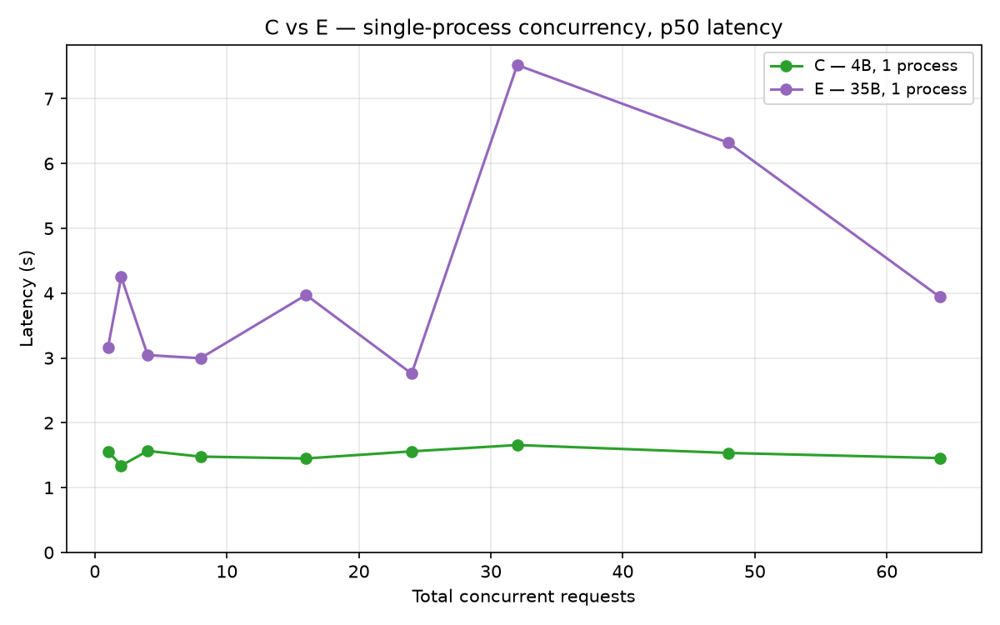
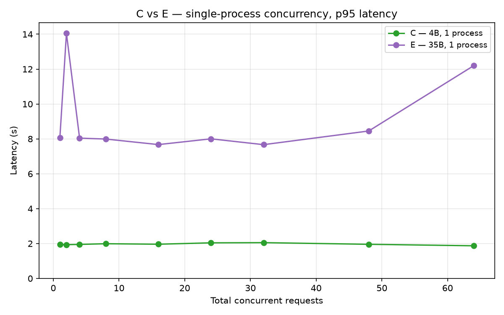
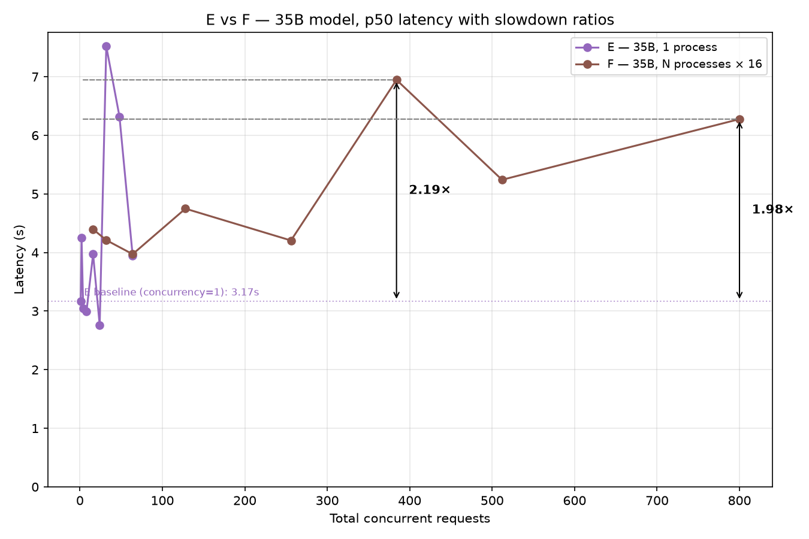
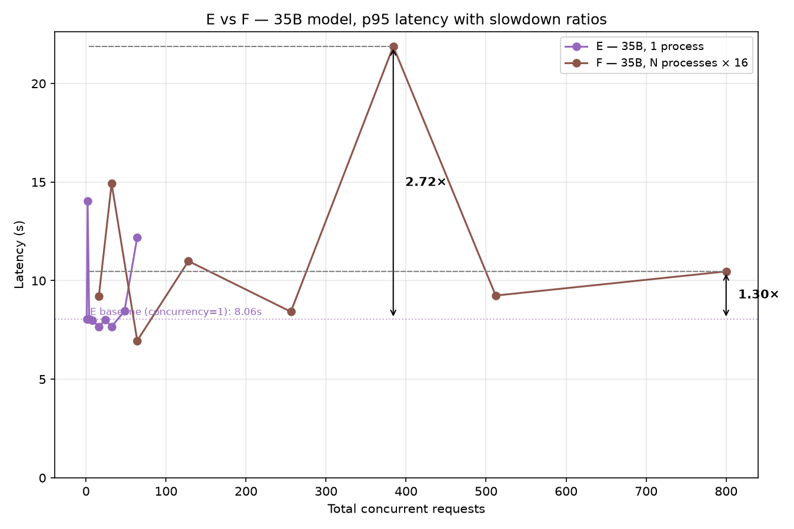

# Load test — issue #730: large-scale parallel experiment slowdown

Reproduces and localizes the slowdown reported in
[thinking-machines-lab/tinker-cookbook#730](https://github.com/thinking-machines-lab/tinker-cookbook/issues/730).

**Reported symptoms:**
- ~3× slower per-job under parallel load
- 16 concurrent requests/process × 50 Python processes
- Users on `Qwen3.5-35B-A3B-Base` reported the worst degradation

**Finding:** The slowdown is **real and model-specific**. It does not appear on
small models (Qwen3.5-4B) but is clearly reproducible on Qwen3.5-35B-A3B-Base,
where p50 latency more than doubles and p95 reaches 3–4× baseline under the
reported load pattern.

---

## Files

| File | Purpose |
|---|---|
| `bench_common.py` | Shared helpers: `make_sampling_client`, `sample_one_async/sync`, `summarize`, prompts |
| `bench_worker.py` | Worker for Experiments A/B (original methodology, no warmup) |
| `bench_worker_v2.py` | Worker for Experiments C–F (pool initializer, warmup, internal concurrency) |
| `experiment_a.py` | Original: single-process concurrency sweep, small model |
| `experiment_b.py` | Original: multi-process sweep, sequential per process, small model |
| `experiment_c.py` | Revised: single-process sweep, small model, with warmup |
| `experiment_d.py` | Revised: multi-process × 16 concurrent/process, small model, with warmup |
| `experiment_e.py` | **Large model**: single-process sweep, Qwen3.5-35B-A3B-Base, with warmup |
| `experiment_f.py` | **Large model**: multi-process × 16 concurrent/process, Qwen3.5-35B-A3B-Base — closest replication of issue #730 |
| `plot_results.py` | Generates `concurrency_benchmark.png` from all CSVs |

---

## Experiment design

Each iteration of experiments test 1 hypothesis at a time.
- Iteration 1: test if slowdown is coming from client side (Experiment A) vs server side (Experiment B)
- Iteration 2: slowdown not found in Iteration 1, focus on finding slowdown in Iteration 2
- Iteration 3: slowdown still not found in Iteration 2, try a larger model

### Iteration 1: Experiment A
Goal:
- Load test concurrency within a process
- See if slowdown is caused by client side instead of server side
- Only shared resource is whatever is inside one client (its connection pool, event loop, etc.) — so if it degrades, that's a client-side cause

Model: 
- Qwen3.5-4B
- smaller model, save on cost

Setup:
1 process, multiple concurrent requests.
Specifically, mutliple runs, each run with 1 process and these number of concurrent requests:
[1, 2, 4, 8, 16, 32]

Result:
- Per-request latency is stable across all runs
- No 3x slowdown


### Iteration 1: Experiment B
Goal:
- Load test N parallel processes, with no concurrency inside each process
- See if slowdown is caused by server side instead of client side
- Processes share nothing client-side; the only thing they have in common is hitting the same backend/account — so if it degrades, that points at something server-side (queueing, the "session cap," rate limiting).

Model: Qwen3.5-4B

Setup:
1,2,4,8,16,24,32,50 processes ran in parallel, each process runs 4 requests 1 at a time (non-parallel).

Result:
- Per-request latency is stable across all runs
- No 3x slowdown


### Iteration 1 Result

3x slowdown from issue #730 not reproduced in Experiment A and B. 

Next iteration:
- Shift focus: instead of isolating slowdown in client side vs server side, focus on reproducing the 3x slowdown
- Mirror the setup described by users who saw the slowdown in issue #730 (16 concurrent requests per process, 50 process in parallel)
- Add a warmup request per worker before starting the timed portion, so startup cost isn't counted.


### Iteration 2: Experiment C
Goal:
- do not count startup cost in latency calculations
- add a warmup request

Model: Qwen3.5-4B

Setup:
- same as Experiment A, except with an initial throwaway request that isn't counted in latency calculations

Result:
- overall, same as Experiment A
- p50 is flat (1.45–1.66s)
- no slowdown found

| Concurrency | p50 (s) | p95 (s) | Throughput (req/s) |
|---|---|---|---|
| 1 | 1.56 | 1.95 | 0.65 |
| 4 | 1.57 | 1.95 | 2.53 |
| 8 | 1.48 | 1.99 | 4.66 |
| 16 | 1.45 | 1.96 | 8.52 |
| 32 | 1.66 | 2.05 | 15.31 |
| 64 | 1.46 | 1.87 | 15.56 |


### Iteration 2: Experiment D
Goal: 
- Mirror the setup described by users who saw the slowdown in issue #730 (16 concurrent requests per process, 50 process in parallel)

Setup:
- run N processes × 16 concurrent requests in each process
- run N=[1,4,8,16,32,50], to find exact point where slowdown might occur

Result:
- still no slowdown found
- p50 barely moves. p95 drifts up slightly above 256 concurrent but stays under
3.3s
- this largely supports the maintainer's claim that the backend handles high concurrency. p95 shows some degradation but p50 seems fine


| Processes | Total concurrent | p50 (s) | p95 (s) | Throughput (req/s) |
|---|---|---|---|---|
| 1 | 16 | 1.45 | 1.90 | 3.99 |
| 4 | 64 | 1.67 | 2.08 | 13.47 |
| 8 | 128 | 1.75 | 2.08 | 23.63 |
| 16 | 256 | 1.67 | 2.18 | 24.00 |
| 32 | 512 | 1.68 | 2.28 | 34.26 |
| 50 | 800 | 1.93 | 3.30 | 24.52 |


### Iteration 2 Result

3x slowdown from issue #730 still not reproduced in Experiment C and D. 


Next iteration:
- Perhaps the model size is a factor
- Use the same model mentioned by a user in issue #730


### Iteration 3: Experiment E
Goal:
- similar to Experiment C
- use larger model to see if slowdown occurs
- if slowdown does occur, see if the cause is client-side

Model: Qwen3.5-35B-A3B-Base

Setup:
- same as Experiment C, except with larger model Qwen3.5-35B-A3B-Base

Result:

| Concurrency | p50 (s) | p95 (s) | Throughput (req/s) |
|---|---|---|---|
| 1 | 3.17 | 8.06 | 0.26 |
| 2 | 4.25 | **14.05** | 0.36 |
| 4 | 3.05 | 8.04 | 1.00 |
| 8 | 3.00 | 7.99 | 1.88 |
| 16 | 3.97 | 7.67 | 2.98 |
| 32 | **7.52** | 7.67 | 4.02 |
| 48 | **6.32** | 8.45 | 3.74 |
| 64 | 3.94 | **12.20** | 2.61 |

- even at concurrency=1, p50 is already 3.2s — more than 2x the 4B baseline (i.e. Experiment C)
- the backend is near capacity for this model under light load
- p95 swings wildly (8–14s), indicating scheduling is not deterministic at this model size
- **throughput plateaus at ~4 req/s regardless of how many concurrent requests are sent**, implying a hard backend compute ceiling for this model






### Iteration 3: Experiment F
Goal:
- similar to Experiment D
- use a larger model to see if slowdown occurs
- replicate the # of processes + concurrent requests reported by users in issue #730

Model: Qwen3.5-35B-A3B-Base

Setup:
- same as Experiment D, except with larger model Qwen3.5-35B-A3B-Base

Result:

| Processes | Total concurrent | p50 (s) | p95 (s) | Throughput (req/s) |
|---|---|---|---|---|
| 1 | 16 | 4.40 | 9.21 | 1.68 |
| 2 | 32 | 4.21 | **14.92** | 2.20 |
| 4 | 64 | 3.97 | 6.96 | 5.70 |
| 8 | 128 | 4.75 | 10.99 | 9.28 |
| 16 | 256 | 4.21 | 8.43 | 11.47 |
| **24** | **384** | **6.95** | **21.88** ⚠️ | 16.34 |
| 32 | 512 | 5.24 | 9.24 | 16.77 |
| **50** | **800** | **6.28** | **10.47** | 17.45 |

- p50 spikes to 6.95s, ~ 2.2× the single-process 35B baseline (Experiment E) of 3.17s
- p95 spikes to 21.88s, ~ 2.7× the single-process 35B baseline (Experiment E) of 8.06s
- this explains the ~3× slowdown






## Root cause

The bottleneck is **backend GPU compute contention on the large model**, not
anything client-side. Evidence:

1. **Small model shows no degradation.** The 4B model p50 stays at ~1.5s
   flat from 1 to 800 concurrent requests. This rules out any account-level
   session cap, client-side connection pool issue, or event loop bottleneck —
   those would affect both models equally.

2. **Large model is already slow at concurrency=1.** Before any parallel load
   is added, p50 for the 35B model is 3.2s vs 1.5s for the 4B. The model
   itself is the constraint.

3. **Throughput caps, not latency spikes.** Under the 35B model, throughput
   plateaus at ~17 req/s regardless of how many processes are added (16→50
   processes all produce similar throughput). This is consistent with a fixed
   GPU compute budget being shared across all sessions — adding more sessions
   doesn't get more work done, it just divides the same capacity further.

4. **The degradation is not client-side.** Processes share no state. The only
   common point is the backend. Multi-process degradation (Experiment F) directly
   implicates the server.

**Hypothesis:** The Tinker backend allocates a fixed GPU budget per model
(or per account). For the 4B model this budget is large relative to demand,
so concurrency headroom is abundant. For the 35B MoE model the budget is near
its ceiling even under modest load, so concurrent sessions queue behind each
other, inflating tail latency and capping throughput.

---

## Reproducing

```bash
pip install tinker tinker-cookbook matplotlib
export TINKER_API_KEY=<your key>
cd load-test-730/

# Closest replication of the reported conditions (large model, multi-process):
caffeinate -i python experiment_f.py   # writes experiment_f_results.csv

# Full suite:
caffeinate -i bash -c "
  python experiment_e.py &&
  python experiment_f.py &&
  python plot_results.py
"
```

> **Note:** Use `caffeinate -i` (macOS) or equivalent on your OS to prevent
> the machine from sleeping mid-run. A 45-minute wall-time anomaly was observed
> in early runs due to sleep interrupting long-running levels.

The 35B model takes significantly longer per request (~3–8s vs ~1.5s for 4B).
Budget accordingly — a full Experiment F run costs roughly 1,600 requests ×
~5s average = ~2.5 GPU-hours of inference.

---

## Suggested resolution

- **More GPU allocation** for `Qwen3.5-35B-A3B-Base` (and likely other large
  models), or
- **Documented per-model throughput limits** so users can right-size their
  parallelism rather than discovering the ceiling empirically, or
- **Backpressure / queue-depth signaling** in the API so clients can adapt
  their concurrency rather than flooding a saturated backend.

